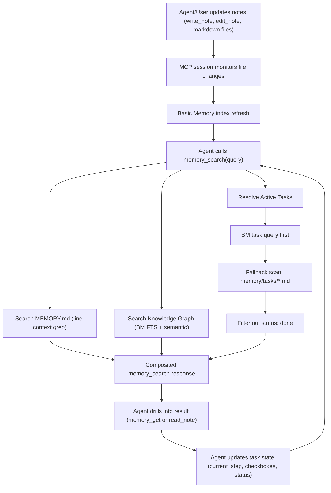

# Memory + Task Flow

This document explains how `openclaw-basic-memory` manages short-term memory, long-term memory, and active tasks during normal agent usage.

## Mental Model

The plugin composes memory from three places:

1. `MEMORY.md` (working memory): lightweight, grep-style retrieval.
2. Basic Memory knowledge graph: semantic + FTS search over indexed markdown notes.
3. `memory/tasks/*.md` (active tasks): execution state with explicit status.

`memory_search` merges these into one response so agents can reason over current context and durable notes together.

> **Note on MEMORY.md role:** OpenClaw's default convention treats `MEMORY.md` as [long-term curated memory](https://docs.openclaw.ai/concepts/memory) — decisions, preferences, and durable facts. This plugin **flips that role**: because Basic Memory provides a full knowledge graph for durable storage (`memory/**/*.md`), `MEMORY.md` serves as short-horizon working memory instead. Long-lived knowledge belongs in the knowledge graph where it gets indexed, linked, and searchable. `MEMORY.md` stays concise and focused on current session context.

## End-to-End Flow

1. Agent/user writes notes with `write_note` (or manually edits markdown files).
2. The MCP session monitors file changes and indexes them automatically.
3. Updated notes become searchable in the knowledge graph.
4. Agent calls `memory_search`:
   - searches `MEMORY.md` for matching lines with context
   - queries BM graph for top knowledge results
   - resolves active tasks (graph query first, filesystem fallback)
5. Agent calls `memory_get` or `read_note` for full note content.
6. Agent updates notes/tasks via `edit_note`.
7. Completed tasks are excluded from active task results when `status: done`.



## Task Notes: Recommended Structure

Use `memory/tasks/` and include:

- `status` in frontmatter (`active`, `blocked`, `done`, etc.)
- `current_step` in frontmatter
- `## Context` section with concise situational state

Example:

```markdown
---
title: migrate-auth-routes
type: Task
status: active
current_step: 3
---

## Context
Auth middleware is deployed behind a flag. Monitoring error rates before full rollout.

## Plan
- [x] Add middleware
- [x] Add tests
- [x] Deploy to staging
- [ ] Validate metrics
- [ ] Roll out to production
```

Completion update:

```yaml
status: done
```

## How Active Task Resolution Works

When `memory_search` runs, task results are computed in this order:

1. Query BM graph using a task-focused query.
2. If no results (or BM task query fails), scan `memory/tasks/*.md` directly.
3. Exclude tasks where `status` is exactly `done`.
4. Build preview snippets from task metadata and `## Context`.

This fallback behavior keeps tasks discoverable even if the graph index is stale or temporarily unavailable.

## Common Operations

### Create a task

```
write_note(
  title="migrate-auth-routes",
  folder="tasks",
  content="""---
title: migrate-auth-routes
type: Task
status: active
current_step: 1
---

## Context
Starting auth route migration.

## Plan
- [ ] Implement middleware
- [ ] Add tests"""
)
```

### Advance a task

- Update plan checkboxes with `edit_note` + `replace_section`
- Bump step with `edit_note` + `find_replace` (for `current_step`)

### Complete a task

Use `edit_note` (`find_replace`) to change `status: active` to `status: done`.

## Operational Tips

1. Keep `MEMORY.md` concise and current; move durable details to notes under `memory/`.
2. Prefer one task note per workstream; update it incrementally instead of rewriting.
3. Ensure `memoryDir` points to the directory that contains your `tasks/` folder.
4. If task search looks wrong, verify the MCP session is connected and notes exist in expected paths.

## Bundled Skills

This plugin ships with workflow-oriented skills that are automatically loaded when the plugin is enabled:

- **`memory-tasks`** — standardized task creation/resume/update flow
- **`memory-reflect`** — periodic memory consolidation from recent notes
- **`memory-defrag`** — periodic cleanup/reorganization of memory files
- **`memory-schema`** — schema lifecycle management (infer, create, validate, diff, evolve)
- **`memory-metadata-search`** — structured metadata search by custom frontmatter fields (status, priority, etc.)
- **`memory-notes`** — guidance for writing well-structured notes with observations and relations

No manual installation needed. To update skills or install new ones as they become available:

```bash
npx skills add basicmachines-co/basic-memory-skills --agent openclaw
```

See the upstream source at [`basic-memory-skills`](https://github.com/basicmachines-co/basic-memory-skills).
