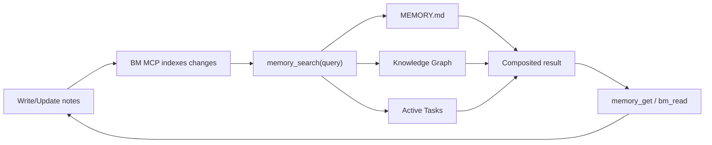

# openclaw-basic-memory

Local-first knowledge graph plugin for OpenClaw — persistent memory with graph search and composited memory search.

## What this plugin does

The `openclaw-basic-memory` plugin integrates [Basic Memory](https://github.com/basicmachines-co/basic-memory) with OpenClaw to provide:

- **Composited `memory_search`** — queries MEMORY.md, the BM knowledge graph, and active tasks in parallel
- **Persistent MCP stdio session** — keeps a single `bm mcp --transport stdio --project <name>` process alive
- **Auto-capture** — records agent conversations as structured daily notes
- **Graph tools** — search, read, write, edit, delete, move, and navigate notes via `memory://` URLs

For a practical runbook, see [Memory + Task Flow](./MEMORY_TASK_FLOW.md).

## Requirements

1. **Basic Memory CLI** (`bm`) — installed automatically by `bun install` when [uv](https://docs.astral.sh/uv/) is available. Manual install:
   ```bash
   # Latest main branch (recommended during pre-release):
   bash scripts/setup-bm.sh

   # Or pin a specific ref:
   BM_REF=v0.18.4 bash scripts/setup-bm.sh
   ```
   If `uv` is not installed, the postinstall step is skipped gracefully. Install `uv` first, then re-run `bash scripts/setup-bm.sh`.

2. **OpenClaw** with plugin support

## Installation

### Install in OpenClaw (local directory)

```bash
git clone https://github.com/basicmachines-co/openclaw-basic-memory.git
cd openclaw-basic-memory
bun install
openclaw plugins install -l "$PWD"
```

Then set this plugin as the memory slot owner in your OpenClaw config:

```json5
{
  plugins: {
    entries: {
      "basic-memory": {
        enabled: true
      }
    },
    slots: {
      memory: "basic-memory"
    }
  }
}
```

Restart OpenClaw gateway after install/config changes, then verify:

```bash
openclaw plugins list
openclaw plugins info basic-memory
```

### Manual Load Path (Dev Alternative)

If you prefer loading directly from a path in config instead of `plugins install`:

```json5
{
  plugins: {
    load: {
      paths: ["~/dev/openclaw-basic-memory"]
    },
    entries: {
      "basic-memory": {
        enabled: true
      }
    },
    slots: {
      memory: "basic-memory"
    }
  }
}
```

### Optional: Install Companion Skills

You can pair this plugin with skills from
[`basic-memory-skills`](https://github.com/basicmachines-co/basic-memory-skills):

- `memory-tasks` — structured task tracking that survives compaction
- `memory-reflect` — periodic consolidation of recent notes into durable memory
- `memory-defrag` — periodic cleanup/reorganization of memory files

Install (workspace-local):

```bash
git clone https://github.com/basicmachines-co/basic-memory-skills.git
cp -r basic-memory-skills/memory-tasks ~/.openclaw/workspace/skills/
cp -r basic-memory-skills/memory-reflect ~/.openclaw/workspace/skills/
cp -r basic-memory-skills/memory-defrag ~/.openclaw/workspace/skills/
```

If you want these skills available to multiple workspaces/agents on the same machine,
install to `~/.openclaw/skills/` instead.

After installation, start a new OpenClaw session so the refreshed skill set is loaded.

## Configuration

### Minimal (zero-config)
```json5
{
  "basic-memory": {
    enabled: true
  }
}
```

This uses sensible defaults: auto-generated project name, maps Basic Memory to your workspace `memory/` directory, and captures conversations.

### Full configuration
```json5
{
  "basic-memory": {
    enabled: true,
    config: {
      project: "my-agent",                          // BM project name (default: "openclaw-{hostname}")
      bmPath: "bm",                                 // Path to BM CLI binary
      projectPath: "~/.openclaw/workspace/memory/",   // Optional override; supports absolute, ~/..., or workspace-relative paths
      memoryDir: "memory/",                          // Relative memory dir for task scanning
      memoryFile: "MEMORY.md",                       // Working memory file for grep search
      autoCapture: true,                             // Index conversations automatically
      captureMinChars: 10,                           // Min chars to trigger auto-capture
      debug: false,                                  // Verbose logging
      cloud: {                                       // Optional cloud sync
        url: "https://cloud.basicmemory.com",
        api_key: "your-key"
      }
    }
  }
}
```

### Configuration Options

| Option | Type | Default | Description |
|--------|------|---------|-------------|
| `project` | string | `"openclaw-{hostname}"` | Basic Memory project name |
| `bmPath` | string | `"bm"` | Path to Basic Memory CLI binary |
| `projectPath` | string | `"memory/"` | Directory for BM project data (resolved from workspace unless absolute) |
| `memoryDir` | string | `"memory/"` | Relative path for task scanning |
| `memoryFile` | string | `"MEMORY.md"` | Working memory file (grep-searched) |
| `autoCapture` | boolean | `true` | Auto-index agent conversations |
| `captureMinChars` | number | `10` | Minimum character threshold for auto-capture (both messages must be shorter to skip) |
| `debug` | boolean | `false` | Enable verbose debug logs |
| `cloud` | object | — | Optional cloud sync config (`url` + `api_key`) |

Snake_case aliases (`memory_dir`, `memory_file`) are also supported.

On startup, the plugin ensures the configured BM project exists at `projectPath` via MCP `create_memory_project` in idempotent mode.

## How It Works

### MCP Session Lifecycle
On startup, the plugin starts one persistent MCP stdio session:
1. Spawns `bm mcp --transport stdio --project <name>`
2. Verifies required MCP tool capabilities at connect time
3. Uses bounded reconnect attempts (`500ms`, `1000ms`, `2000ms`) when the session drops

Basic Memory MCP lifecycle handles sync and watch behavior for the project.

### Composited `memory_search`
When the agent calls `memory_search`, three sources are queried in parallel:

1. **MEMORY.md** — grep/text search with ±1 line context
2. **BM Knowledge Graph** — hybrid FTS + vector search (top 5 results with scores)
3. **Active Tasks** — scans `memory/tasks/` for non-done tasks

Results are formatted into clear sections:
```
## MEMORY.md
- matching lines with context...

## Knowledge Graph (memory/)
- note-title (0.85)
  > preview of content...

## Active Tasks
- **Task Name** (status: active, step: 3)
  context snippet...
```

### Memory + Task Management Flow

This plugin works best if you treat memory as three lanes:

1. **Working memory (`MEMORY.md`)** — short-horizon context and current focus.
2. **Knowledge graph (`memory/**/*.md`)** — long-term notes indexed by Basic Memory.
3. **Task notes (`memory/tasks/*.md`)** — active execution state for in-flight work.

Typical loop:

1. Capture or update notes/tasks with `bm_write` / `bm_edit`.
2. The persistent BM MCP process syncs markdown updates into the BM project index.
3. `memory_search` queries:
   - `MEMORY.md` text snippets
   - BM search results (semantic + FTS)
   - active tasks
4. Drill into one result with `memory_get` or `bm_read`.
5. Advance tasks by updating `current_step`, checkboxes, and context.
6. Complete tasks by setting `status: done` (done tasks are excluded from active task results).



### Task Note Shape (Recommended)

`memory_search` task extraction is strongest when task notes include:

- file location: `memory/tasks/*.md`
- frontmatter fields: `status:` and `current_step:`
- a `## Context` section for preview snippets

Example:

```markdown
---
title: auth-middleware-rollout
type: Task
status: active
current_step: 2
---

## Context
Rolling JWT middleware to all API routes. Staging verification is in progress.

## Plan
- [x] Implement middleware
- [x] Add refresh-token validation
- [ ] Roll out to staging
- [ ] Verify logs and error rates
```

To mark complete, update:

```yaml
status: done
```

Done tasks are filtered out of the `Active Tasks` section in composited `memory_search`.

### Auto-Capture
After each agent turn (when `autoCapture: true`), the plugin:
1. Extracts the last user + assistant messages
2. Appends them as timestamped entries to a daily conversation note (`conversations-YYYY-MM-DD`)
3. Skips very short exchanges (< `captureMinChars` chars each, default 10)

## Agent Tools

### `bm_search`
Search the knowledge graph.
```typescript
bm_search({ query: "API design", limit: 5 })
```

### `bm_read`
Read a note by title, permalink, or `memory://` URL.
```typescript
bm_read({ identifier: "memory://projects/api-redesign" })
bm_read({ identifier: "memory://projects/api-redesign", include_frontmatter: true }) // raw markdown + YAML
```

### `bm_write`
Create a new note.
```typescript
bm_write({ title: "Auth Strategy", content: "## Overview\n...", folder: "decisions" })
```

### `bm_edit`
Edit an existing note (`append`, `prepend`, `find_replace`, `replace_section`).
```typescript
bm_edit({ identifier: "weekly-review", operation: "append", content: "\n## Update\nDone." })
bm_edit({
  identifier: "weekly-review",
  operation: "find_replace",
  find_text: "status: active",
  content: "status: done",
  expected_replacements: 1,
})
bm_edit({
  identifier: "weekly-review",
  operation: "replace_section",
  section: "## This Week",
  content: "- ✅ Done\n- 🔄 Next",
})
```

### `bm_delete`
Delete a note.
```typescript
bm_delete({ identifier: "notes/old-draft" })
```

### `bm_move`
Move a note to a different folder.
```typescript
bm_move({ identifier: "notes/my-note", newFolder: "archive" })
```

### `bm_context`
Navigate the knowledge graph — get a note with its observations and relations.
```typescript
bm_context({ url: "memory://projects/api-redesign", depth: 2 })
```

### `bm_schema_validate`
Validate notes against their Picoschema definitions.
```typescript
bm_schema_validate({ noteType: "person" })
bm_schema_validate({ identifier: "notes/john-doe" })
```

### `bm_schema_infer`
Analyze existing notes and suggest a Picoschema definition.
```typescript
bm_schema_infer({ noteType: "meeting" })
bm_schema_infer({ noteType: "person", threshold: 0.5 })
```

### `bm_schema_diff`
Detect drift between a schema definition and actual note usage.
```typescript
bm_schema_diff({ noteType: "person" })
```

## Slash Commands

- **`/remember <text>`** — Save a quick note
- **`/recall <query>`** — Search the knowledge graph

## CLI Commands

```bash
openclaw basic-memory search "auth patterns" --limit 5
openclaw basic-memory read "projects/api-redesign"
openclaw basic-memory read "projects/api-redesign" --raw
openclaw basic-memory edit "projects/api-redesign" --operation append --content $'\n## Update\nDone.'
openclaw basic-memory context "memory://projects/api-redesign" --depth 2
openclaw basic-memory recent --timeframe 24h
openclaw basic-memory status
```

## Troubleshooting

### `bm` command not found
```bash
which bm              # Check if installed
bm --version          # Check version
bm mcp --help         # Verify MCP server command exists
```
If `bm mcp` doesn't exist, update Basic Memory to a newer version.

### `bm_edit` says `edit-note` is required
Your installed `basic-memory` version is missing native `tool edit-note`.
Upgrade `basic-memory` and rerun.

### Jiti cache issues
```bash
rm -rf /tmp/jiti/ "$TMPDIR/jiti/"
openclaw gateway stop && openclaw gateway start
```

### Search returns no results
1. Check that the MCP session is connected (look for `connected to BM MCP stdio` in logs)
2. Verify files exist in the project directory
3. Try `bm mcp --transport stdio --project <name>` and run `search_notes` through an MCP inspector/client
4. Check project status: `bm project list`

## Integration Tests

This repo includes real end-to-end integration tests for `BmClient` in:

- `/Users/phernandez/dev/basicmachines/openclaw-basic-memory/integration/bm-client.integration.test.ts`

These tests launch a real `bm mcp --transport stdio --project <name>` process,
run write/read/edit/search/context/move/delete calls, and assert actual filesystem/index results.

Run integration tests:

```bash
bun run test:int
```

By default this uses `./scripts/bm-local.sh`, which runs BM from a sibling
`../basic-memory` checkout via `uv run --project ...` when present, and falls
back to `bm` on `PATH` otherwise.

Optional overrides:

```bash
# Use a non-default bm binary
BM_BIN=/absolute/path/to/bm bun run test:int

# Use a specific basic-memory source checkout
BASIC_MEMORY_REPO=/absolute/path/to/basic-memory bun run test:int
```

## Development

```bash
bun run check-types   # Type checking
bun run lint          # Linting
bun test              # Run tests (156 tests)
bun run test:int      # Real BM MCP integration tests
```

## Publish to npm

This package is published as `@openclaw/basic-memory`.

```bash
# 1) Verify release readiness (types + tests + npm pack dry run)
just release-check

# 2) Inspect publish payload
just release-pack

# 3) Authenticate once (if needed)
npm login

# 4) Publish current version from package.json
just release-publish
```

For a full release (version bump + publish + push tag):

```bash
just release patch   # or: minor, major, 0.2.0, etc.
```

### GitHub Actions CI/CD

- CI workflow: `.github/workflows/ci.yml` runs on PRs and `main` pushes.
- Release workflow: `.github/workflows/release.yml` runs manually (`workflow_dispatch`) and will:
  1. run release checks
  2. bump version and create a git tag
  3. push commit + tag
  4. publish to npm
  5. create a GitHub release

Repository secret required:

- `NPM_TOKEN` (npm publish token with package publish permissions)

### Project Structure
```
openclaw-basic-memory/
├── index.ts              # Plugin entry — manages MCP lifecycle, registers tools
├── config.ts             # Configuration parsing
├── bm-client.ts          # Persistent Basic Memory MCP stdio client
├── tools/                # Agent tools
│   ├── search.ts         # bm_search
│   ├── read.ts           # bm_read
│   ├── write.ts          # bm_write
│   ├── edit.ts           # bm_edit
│   ├── delete.ts         # bm_delete
│   ├── move.ts           # bm_move
│   ├── context.ts        # bm_context
│   ├── schema-validate.ts # bm_schema_validate
│   ├── schema-infer.ts   # bm_schema_infer
│   ├── schema-diff.ts    # bm_schema_diff
│   └── memory-provider.ts # Composited memory_search + memory_get
├── commands/
│   ├── slash.ts          # /remember, /recall
│   └── cli.ts            # openclaw basic-memory CLI
└── hooks/
    └── capture.ts        # Auto-capture conversations
```

## License

MIT — see LICENSE file.

## Links

- [Basic Memory](https://github.com/basicmachines-co/basic-memory)
- [Basic Memory Skills](https://github.com/basicmachines-co/basic-memory-skills)
- [OpenClaw](https://docs.openclaw.ai)
- [Issues](https://github.com/basicmachines-co/openclaw-basic-memory/issues)
