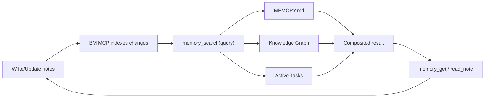

# openclaw-basic-memory

Local-first knowledge graph plugin for OpenClaw — persistent memory with graph search and composited memory search. Everything works locally with no cloud account required.

## What this plugin does

The `openclaw-basic-memory` plugin integrates [Basic Memory](https://github.com/basicmachines-co/basic-memory) with OpenClaw to provide:

- **Composited `memory_search`** — queries MEMORY.md, the BM knowledge graph, and active tasks in parallel
- **Persistent MCP stdio session** — keeps a single `bm mcp --transport stdio --project <name>` process alive
- **Auto-recall** — injects active tasks and recent activity as context at session start
- **Auto-capture** — records agent conversations as structured daily notes
- **Graph tools** — search, read, write, edit, delete, move, and navigate notes via `memory://` URLs
- **Skill workflows** — `/tasks`, `/reflect`, `/defrag`, `/schema` slash commands for guided memory management

All data stays on your machine as markdown files indexed locally with SQLite. Cloud sync is available but entirely optional — see [BASIC_MEMORY.md](./BASIC_MEMORY.md) for cloud setup.

For a practical runbook, see [Memory + Task Flow](./MEMORY_TASK_FLOW.md).

## Requirements

1. **[uv](https://docs.astral.sh/uv/)** — Python package manager used to install Basic Memory CLI
   ```bash
   # macOS
   brew install uv

   # macOS / Linux
   curl -LsSf https://astral.sh/uv/install.sh | sh
   ```

2. **[OpenClaw](https://docs.openclaw.ai)** with plugin support

## Installation

```bash
# Install the plugin (automatically installs the bm CLI via uv)
openclaw plugins install @basicmemory/openclaw-basic-memory

# Restart the gateway
openclaw gateway restart
```

Verify:
```bash
openclaw plugins list
openclaw plugins info openclaw-basic-memory
```

If `uv` is not installed, the `bm` CLI setup is skipped gracefully during install. Install `uv` first, then re-run the postinstall script:

```bash
bash ~/.openclaw/extensions/openclaw-basic-memory/scripts/setup-bm.sh
```

### Basic Memory Cloud

Everything works locally — cloud adds cross-device, team, and production capabilities:

- **Your agent's memory travels with you** — same knowledge graph on laptop, desktop, and hosted environments
- **Team knowledge sharing** — org workspaces let multiple agents and team members build on a shared knowledge base
- **Durable memory for production agents** — persistent memory that survives CI teardowns and container restarts
- **Multi-agent coordination** — multiple agents can read and write to the same graph

Cloud extends local-first — still plain markdown, still yours. Start with a [7-day free trial](https://basicmemory.com) and use code `BMCLAW` for 20% off for 3 months. See [BASIC_MEMORY.md](./BASIC_MEMORY.md) for cloud setup.

### Development (local directory)

For plugin development, clone and link locally:

```bash
git clone https://github.com/basicmachines-co/openclaw-basic-memory.git
cd openclaw-basic-memory
bun install
openclaw plugins install -l "$PWD"
openclaw plugins enable openclaw-basic-memory --slot memory
openclaw gateway restart
```

Or load directly from a path in your OpenClaw config:

```json5
{
  plugins: {
    load: {
      paths: ["~/dev/openclaw-basic-memory"]
    },
    entries: {
      "openclaw-basic-memory": {
        enabled: true
      }
    },
    slots: {
      memory: "openclaw-basic-memory"
    }
  }
}
```

### Bundled Skills

This plugin ships with six skills that are automatically available when the plugin is enabled — no manual installation needed:

- **`memory-tasks`** — structured task tracking that survives context compaction
- **`memory-reflect`** — periodic consolidation of recent notes into durable memory
- **`memory-defrag`** — periodic cleanup/reorganization of memory files
- **`memory-schema`** — schema lifecycle management (infer, create, validate, diff, evolve)
- **`memory-metadata-search`** — structured metadata search by custom frontmatter fields (status, priority, etc.)
- **`memory-notes`** — guidance for writing well-structured notes with observations and relations

Skills are loaded from the plugin's `skills/` directory. See the upstream source at [`basic-memory-skills`](https://github.com/basicmachines-co/basic-memory-skills).

#### Updating or adding skills with `npx skills`

You can update bundled skills or install new ones as they become available using the [Skills CLI](https://github.com/vercel-labs/skills):

```bash
# Update all basic-memory skills to latest
npx skills add basicmachines-co/basic-memory-skills --agent openclaw

# Install a specific skill
npx skills add basicmachines-co/basic-memory-skills --name memory-tasks --agent openclaw
```

This installs to the same `skills/` directory the plugin reads from, so updated skills take effect on the next session.

## Configuration

### Minimal (zero-config)
```json5
{
  "openclaw-basic-memory": {
    enabled: true
  }
}
```

This uses sensible defaults: auto-generated project name, maps Basic Memory to your workspace root, sets it as the default BM project, and captures conversations.

### Full configuration
```json5
{
  "openclaw-basic-memory": {
    enabled: true,
    config: {
      project: "my-agent",                          // BM project name (default: "openclaw-{hostname}")
      bmPath: "bm",                                 // Path to BM CLI binary
      projectPath: ".",                                  // Defaults to workspace root; supports absolute, ~/..., or workspace-relative paths
      memoryDir: "memory/",                          // Relative memory dir for task scanning
      memoryFile: "MEMORY.md",                       // Working memory file for grep search
      autoCapture: true,                             // Index conversations automatically
      captureMinChars: 10,                           // Min chars to trigger auto-capture
      autoRecall: true,                              // Inject active tasks + recent activity at session start
      recallPrompt: "Check for active tasks and recent activity. Summarize anything relevant to the current session.",
      debug: false,                                  // Verbose logging
    }
  }
}
```

### Configuration Options

| Option | Type | Default | Description |
|--------|------|---------|-------------|
| `project` | string | `"openclaw-{hostname}"` | Basic Memory project name |
| `bmPath` | string | `"bm"` | Path to Basic Memory CLI binary |
| `projectPath` | string | `"."` | Directory for BM project data (defaults to workspace root; resolved from workspace unless absolute) |
| `memoryDir` | string | `"memory/"` | Relative path for task scanning |
| `memoryFile` | string | `"MEMORY.md"` | Working memory file (grep-searched) |
| `autoCapture` | boolean | `true` | Auto-index agent conversations |
| `captureMinChars` | number | `10` | Minimum character threshold for auto-capture (both messages must be shorter to skip) |
| `autoRecall` | boolean | `true` | Inject active tasks and recent activity as context at session start |
| `recallPrompt` | string | *(see above)* | Instruction appended to recalled context — customize to change what the agent focuses on |
| `debug` | boolean | `false` | Enable verbose debug logs |

Snake_case aliases (`memory_dir`, `memory_file`, `auto_recall`, `recall_prompt`, `capture_min_chars`) are also supported.

Cloud sync is optional — see [BASIC_MEMORY.md](./BASIC_MEMORY.md) for cloud configuration.

On startup, the plugin ensures the configured BM project exists at `projectPath` via MCP `create_memory_project` in idempotent mode, and sets it as the default Basic Memory project.

## How It Works

### MCP Session Lifecycle
On startup, the plugin starts one persistent MCP stdio session:
1. Spawns `bm mcp --transport stdio --project <name>`
2. Verifies required MCP tool capabilities at connect time
3. Uses bounded reconnect attempts (`500ms`, `1000ms`, `2000ms`) when the session drops

Basic Memory MCP lifecycle handles sync and watch behavior for the project.

### Composited `memory_search`
When the agent calls `memory_search`, three sources are queried in parallel:

1. **MEMORY.md** — grep/text search with ±1 line context
2. **BM Knowledge Graph** — hybrid FTS + vector search (top 5 results with scores)
3. **Active Tasks** — scans `memory/tasks/` for non-done tasks

Results are formatted into clear sections:
```
## MEMORY.md
- matching lines with context...

## Knowledge Graph (memory/)
- note-title (0.85)
  > preview of content...

## Active Tasks
- **Task Name** (status: active, step: 3)
  context snippet...
```

### Memory + Task Management Flow

This plugin works best if you treat memory as three lanes:

1. **Working memory (`MEMORY.md`)** — short-horizon context and current focus.
2. **Knowledge graph (`memory/**/*.md`)** — long-term notes indexed by Basic Memory.
3. **Task notes (`memory/tasks/*.md`)** — active execution state for in-flight work.

> **Note:** OpenClaw's default convention treats `MEMORY.md` as [long-term curated memory](https://docs.openclaw.ai/concepts/memory). This plugin flips that role — the BM knowledge graph handles durable storage, so `MEMORY.md` serves as short-horizon working memory. See [MEMORY_TASK_FLOW.md](./MEMORY_TASK_FLOW.md) for details.

Typical loop:

1. Capture or update notes/tasks with `write_note` / `edit_note`.
2. The persistent BM MCP process syncs markdown updates into the BM project index.
3. `memory_search` queries:
   - `MEMORY.md` text snippets
   - BM search results (semantic + FTS)
   - active tasks
4. Drill into one result with `memory_get` or `read_note`.
5. Advance tasks by updating `current_step`, checkboxes, and context.
6. Complete tasks by setting `status: done` (done tasks are excluded from active task results).



### Task Note Shape (Recommended)

`memory_search` task extraction is strongest when task notes include:

- file location: `memory/tasks/*.md`
- frontmatter fields: `status:` and `current_step:`
- a `## Context` section for preview snippets

Example:

```markdown
---
title: auth-middleware-rollout
type: Task
status: active
current_step: 2
---

## Context
Rolling JWT middleware to all API routes. Staging verification is in progress.

## Plan
- [x] Implement middleware
- [x] Add refresh-token validation
- [ ] Roll out to staging
- [ ] Verify logs and error rates
```

To mark complete, update:

```yaml
status: done
```

Done tasks are filtered out of the `Active Tasks` section in composited `memory_search`.

### Auto-Recall
On each `agent_start` event (when `autoRecall: true`), the plugin:
1. Queries the knowledge graph for active tasks (`type: Task`, `status: active`, up to 5)
2. Fetches notes modified in the last 24 hours
3. Formats both into structured context and returns it to the agent

This gives the agent immediate awareness of ongoing work and recent changes without the user needing to ask. The `recallPrompt` config field controls the instruction appended to the context — customize it to steer what the agent prioritizes.

### Auto-Capture
After each agent turn (when `autoCapture: true`), the plugin:
1. Extracts the last user + assistant messages
2. Appends them as timestamped entries to a daily conversation note (`conversations-YYYY-MM-DD`)
3. Skips very short exchanges (< `captureMinChars` chars each, default 10)

## Agent Tools

All content tools accept an optional `project` parameter to operate on a different project than the default (cross-project operations).

### `list_workspaces`
List all workspaces (personal and organization) accessible to this user.
```
list_workspaces()
```

### `list_memory_projects`
List all projects, optionally filtered by workspace.
```
list_memory_projects()
list_memory_projects(workspace="my-org")
```

### `search_notes`
Search the knowledge graph.
```
search_notes(query="API design", limit=5)
search_notes(query="API design", project="other-project")  # cross-project
```

### `read_note`
Read a note by title, permalink, or `memory://` URL.
```
read_note(identifier="memory://projects/api-redesign")
read_note(identifier="memory://projects/api-redesign", include_frontmatter=true)  # raw markdown + YAML
read_note(identifier="notes/readme", project="docs")  # cross-project
```

### `write_note`
Create a new note.
```
write_note(title="Auth Strategy", content="## Overview\n...", folder="decisions")
write_note(title="Shared Note", content="...", folder="shared", project="team")  # cross-project
```

### `edit_note`
Edit an existing note (`append`, `prepend`, `find_replace`, `replace_section`).
```
edit_note(identifier="weekly-review", operation="append", content="\n## Update\nDone.")
edit_note(
  identifier="weekly-review",
  operation="find_replace",
  find_text="status: active",
  content="status: done",
  expected_replacements=1,
)
edit_note(
  identifier="weekly-review",
  operation="replace_section",
  section="## This Week",
  content="- Done\n- Next",
)
```

### `delete_note`
Delete a note.
```
delete_note(identifier="notes/old-draft")
delete_note(identifier="notes/old-draft", project="archive")  # cross-project
```

### `move_note`
Move a note to a different folder.
```
move_note(identifier="notes/my-note", newFolder="archive")
```

### `build_context`
Navigate the knowledge graph — get a note with its observations and relations.
```
build_context(url="memory://projects/api-redesign", depth=2)
build_context(url="memory://decisions", depth=1, project="team")  # cross-project
```

### `schema_validate`
Validate notes against their Picoschema definitions.
```
schema_validate(noteType="person")
schema_validate(identifier="notes/john-doe")
schema_validate(noteType="person", project="contacts")  # cross-project
```

### `schema_infer`
Analyze existing notes and suggest a Picoschema definition.
```
schema_infer(noteType="meeting")
schema_infer(noteType="person", threshold=0.5)
```

### `schema_diff`
Detect drift between a schema definition and actual note usage.
```
schema_diff(noteType="person")
```

## Slash Commands

### Memory
- **`/remember <text>`** — Save a quick note to the knowledge graph
- **`/recall <query>`** — Search the knowledge graph (top 5 results)

### Skill workflows
These inject step-by-step instructions from the bundled skill files. Each accepts optional arguments for context.

| Command | Description |
|---------|-------------|
| `/tasks [args]` | Task management — create, track, resume structured tasks |
| `/reflect [args]` | Memory reflection — consolidate recent activity into long-term memory |
| `/defrag [args]` | Memory defrag — reorganize, split, prune memory files |
| `/schema [args]` | Schema management — infer, create, validate, evolve Picoschema definitions |

Examples:
```
/tasks create a task for the API migration
/reflect
/defrag clean up completed tasks older than 2 weeks
/schema infer a schema for Meeting notes
```

## CLI Commands

```bash
openclaw basic-memory search "auth patterns" --limit 5
openclaw basic-memory read "projects/api-redesign"
openclaw basic-memory read "projects/api-redesign" --raw
openclaw basic-memory edit "projects/api-redesign" --operation append --content $'\n## Update\nDone.'
openclaw basic-memory context "memory://projects/api-redesign" --depth 2
openclaw basic-memory recent --timeframe 24h
openclaw basic-memory status
```

## Troubleshooting

### `bm` command not found
```bash
which bm              # Check if installed
bm --version          # Check version
bm mcp --help         # Verify MCP server command exists
```
If `bm mcp` doesn't exist, update Basic Memory to a newer version.

### `edit_note` says `edit-note` is required
Your installed `basic-memory` version is missing native `tool edit-note`.
Upgrade `basic-memory` and rerun.

### Jiti cache issues
```bash
rm -rf /tmp/jiti/ "$TMPDIR/jiti/"
openclaw gateway stop && openclaw gateway start
```

### Disabling semantic search
If you want to run without vector/embedding dependencies (faster startup, less memory), set the environment variable before launching:
```bash
BASIC_MEMORY_SEMANTIC_SEARCH_ENABLED=false
```
Or in `~/.basic-memory/config.json`:
```json
{ "semantic_search_enabled": false }
```
Search will fall back to full-text search only.

### Search returns no results
1. Check that the MCP session is connected (look for `connected to BM MCP stdio` in logs)
2. Verify files exist in the project directory
3. Try `bm mcp --transport stdio --project <name>` and run `search_notes` through an MCP inspector/client
4. Check project status: `bm project list`

## Integration Tests

This repo includes real end-to-end integration tests for `BmClient` in:

- `integration/bm-client.integration.test.ts`

These tests launch a real `bm mcp --transport stdio --project <name>` process,
run write/read/edit/search/context/move/delete calls, and assert actual filesystem/index results.

Run integration tests:

```bash
bun run test:int
```

By default this uses `./scripts/bm-local.sh`, which runs BM from a sibling
`../basic-memory` checkout via `uv run --project ...` when present, and falls
back to `bm` on `PATH` otherwise.

Optional overrides:

```bash
# Use a non-default bm binary
BM_BIN=/absolute/path/to/bm bun run test:int

# Use a specific basic-memory source checkout
BASIC_MEMORY_REPO=/absolute/path/to/basic-memory bun run test:int
```

## Development

```bash
bun run check-types   # Type checking
bun run lint          # Linting
bun test              # Run tests (156 tests)
bun run test:int      # Real BM MCP integration tests
```

## Publish to npm

This package is published as `@basicmemory/openclaw-basic-memory`.

```bash
# 1) Verify release readiness (types + tests + npm pack dry run)
just release-check

# 2) Inspect publish payload
just release-pack

# 3) Authenticate once (if needed)
npm login

# 4) Publish current version from package.json
just release-publish
```

For a full release (version bump + publish + push tag):

```bash
just release patch   # or: minor, major, 0.2.0, etc.
```

### GitHub Actions CI/CD

- CI workflow: `.github/workflows/ci.yml` runs on PRs and `main` pushes.
- Release workflow: `.github/workflows/release.yml` runs manually (`workflow_dispatch`) and will:
  1. run release checks
  2. bump version and create a git tag
  3. push commit + tag
  4. publish to npm
  5. create a GitHub release

Publishing uses npm OIDC trusted publishing — no secrets required. The trusted publisher is configured on npmjs.com to accept provenance from this repo's `release.yml` workflow.

### Project Structure
```
openclaw-basic-memory/
├── index.ts              # Plugin entry — manages MCP lifecycle, registers tools
├── config.ts             # Configuration parsing
├── bm-client.ts          # Persistent Basic Memory MCP stdio client
├── tools/                       # Agent tools
│   ├── search-notes.ts          # search_notes
│   ├── read-note.ts             # read_note
│   ├── write-note.ts            # write_note
│   ├── edit-note.ts             # edit_note
│   ├── delete-note.ts           # delete_note
│   ├── move-note.ts             # move_note
│   ├── build-context.ts         # build_context
│   ├── list-memory-projects.ts  # list_memory_projects
│   ├── list-workspaces.ts       # list_workspaces
│   ├── schema-validate.ts       # schema_validate
│   ├── schema-infer.ts          # schema_infer
│   ├── schema-diff.ts           # schema_diff
│   └── memory-provider.ts       # Composited memory_search + memory_get
├── commands/
│   ├── slash.ts          # /remember, /recall
│   ├── skills.ts         # /tasks, /reflect, /defrag, /schema
│   └── cli.ts            # openclaw basic-memory CLI
└── hooks/
    ├── capture.ts        # Auto-capture conversations
    └── recall.ts         # Auto-recall (active tasks + recent activity)
```

## Telemetry

Basic Memory collects anonymous, minimal usage events to understand how the CLI-to-cloud conversion funnel performs. This helps us prioritize features and improve the product.

**What we collect:**
- Cloud promo impressions (when the promo banner is shown)
- Cloud login attempts and outcomes
- Promo opt-out events

**What we do NOT collect:**
- No file contents, note titles, or knowledge base data
- No personally identifiable information (PII)
- No IP address tracking or fingerprinting
- No per-command or per-tool-call tracking

Events are sent to our [Umami Cloud](https://umami.is) instance, an open-source, privacy-focused analytics platform. Events are fire-and-forget on a background thread — analytics never blocks or slows the CLI.

**Opt out** by setting the environment variable:

```bash
export BASIC_MEMORY_NO_PROMOS=1
```

## License

MIT — see LICENSE file.

## Links

- [Basic Memory](https://github.com/basicmachines-co/basic-memory)
- [Basic Memory Skills](https://github.com/basicmachines-co/basic-memory-skills)
- [OpenClaw](https://docs.openclaw.ai)
- [Issues](https://github.com/basicmachines-co/openclaw-basic-memory/issues)
