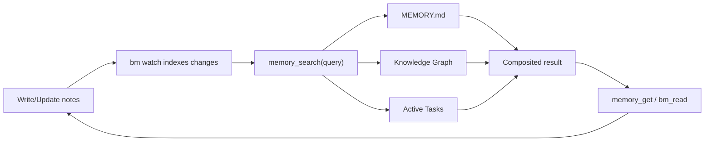

# openclaw-basic-memory

Local-first knowledge graph plugin for OpenClaw — persistent memory with graph search and composited memory search.

## What this plugin does

The `openclaw-basic-memory` plugin integrates [Basic Memory](https://github.com/basicmachines-co/basic-memory) with OpenClaw to provide:

- **Composited `memory_search`** — queries MEMORY.md, the BM knowledge graph, and active tasks in parallel
- **File watching via `bm watch`** — automatically syncs workspace markdown files into the knowledge graph
- **Auto-capture** — records agent conversations as structured daily notes
- **Graph tools** — search, read, write, edit, delete, move, and navigate notes via `memory://` URLs

For a practical runbook, see [Memory + Task Flow](./MEMORY_TASK_FLOW.md).

## Requirements

1. **Basic Memory CLI** (`bm`) with `watch` command support and native tool commands:
   - `bm tool read-note --strip-frontmatter`
   - `bm tool edit-note --format json`
   - Pinned for testing to commit `9259a7eb59be7aa8a72c3ec20d0740bd19ba9657`
   ```bash
   uv tool install 'basic-memory[semantic] @ git+https://github.com/basicmachines-co/basic-memory.git@9259a7eb59be7aa8a72c3ec20d0740bd19ba9657' --with 'onnxruntime<1.24; platform_system == "Darwin" and platform_machine == "x86_64"'

   # Alternative (inside an existing Python environment):
   uv pip install 'basic-memory[semantic] @ git+https://github.com/basicmachines-co/basic-memory.git@9259a7eb59be7aa8a72c3ec20d0740bd19ba9657' 'onnxruntime<1.24; platform_system == "Darwin" and platform_machine == "x86_64"'
   ```

2. **OpenClaw** with plugin support

## Installation

Clone and install:
```bash
git clone https://github.com/basicmachines-co/openclaw-basic-memory.git
cd openclaw-basic-memory
bun install
```

### Optional: Install Companion Skills

You can pair this plugin with skills from
[`basic-memory-skills`](https://github.com/basicmachines-co/basic-memory-skills):

- `memory-tasks` — structured task tracking that survives compaction
- `memory-reflect` — periodic consolidation of recent notes into durable memory
- `memory-defrag` — periodic cleanup/reorganization of memory files

Install (workspace-local):

```bash
git clone https://github.com/basicmachines-co/basic-memory-skills.git
cp -r basic-memory-skills/memory-tasks ~/.openclaw/workspace/skills/
cp -r basic-memory-skills/memory-reflect ~/.openclaw/workspace/skills/
cp -r basic-memory-skills/memory-defrag ~/.openclaw/workspace/skills/
```

If you want these skills available to multiple workspaces/agents on the same machine,
install to `~/.openclaw/skills/` instead.

After installation, start a new OpenClaw session so the refreshed skill set is loaded.

Add to your OpenClaw config:
```json5
{
  plugins: {
    load: {
      paths: ["~/dev/openclaw-basic-memory"]
    },
    entries: {
      "basic-memory": {
        enabled: true
      }
    }
  }
}
```

## Configuration

### Minimal (zero-config)
```json5
{
  "basic-memory": {
    enabled: true
  }
}
```

This uses sensible defaults: auto-generated project name, maps Basic Memory to your workspace `memory/` directory, and captures conversations.

### Full configuration
```json5
{
  "basic-memory": {
    enabled: true,
    config: {
      project: "my-agent",                          // BM project name (default: "openclaw-{hostname}")
      bmPath: "bm",                                 // Path to BM CLI binary
      projectPath: "~/.openclaw/workspace/memory/",   // Optional override; supports absolute, ~/..., or workspace-relative paths
      memoryDir: "memory/",                          // Relative memory dir for task scanning
      memoryFile: "MEMORY.md",                       // Working memory file for grep search
      autoCapture: true,                             // Index conversations automatically
      debug: false,                                  // Verbose logging
      cloud: {                                       // Optional cloud sync
        url: "https://cloud.basicmemory.com",
        api_key: "your-key"
      }
    }
  }
}
```

### Configuration Options

| Option | Type | Default | Description |
|--------|------|---------|-------------|
| `project` | string | `"openclaw-{hostname}"` | Basic Memory project name |
| `bmPath` | string | `"bm"` | Path to Basic Memory CLI binary |
| `projectPath` | string | `"memory/"` | Directory for BM project data (resolved from workspace unless absolute) |
| `memoryDir` | string | `"memory/"` | Relative path for task scanning |
| `memoryFile` | string | `"MEMORY.md"` | Working memory file (grep-searched) |
| `autoCapture` | boolean | `true` | Auto-index agent conversations |
| `debug` | boolean | `false` | Enable verbose debug logs |
| `cloud` | object | — | Optional cloud sync config (`url` + `api_key`) |

Snake_case aliases (`memory_dir`, `memory_file`) are also supported.

On startup, the plugin ensures the configured BM project exists at `projectPath` by running `bm project add <project> <path> --default` when needed.

## How It Works

### File Watching
On startup, the plugin spawns `bm watch --project <name>` as a long-running child process. This:
1. Performs an initial sync of all files in the project directory
2. Watches for file changes and re-indexes automatically
3. Runs until the plugin stops (SIGTERM on shutdown)

No custom file watcher needed — Basic Memory handles everything.

### Composited `memory_search`
When the agent calls `memory_search`, three sources are queried in parallel:

1. **MEMORY.md** — grep/text search with ±1 line context
2. **BM Knowledge Graph** — hybrid FTS + vector search (top 5 results with scores)
3. **Active Tasks** — scans `memory/tasks/` for non-done tasks

Results are formatted into clear sections:
```
## MEMORY.md
- matching lines with context...

## Knowledge Graph (memory/)
- note-title (0.85)
  > preview of content...

## Active Tasks
- **Task Name** (status: active, step: 3)
  context snippet...
```

### Memory + Task Management Flow

This plugin works best if you treat memory as three lanes:

1. **Working memory (`MEMORY.md`)** — short-horizon context and current focus.
2. **Knowledge graph (`memory/**/*.md`)** — long-term notes indexed by Basic Memory.
3. **Task notes (`memory/tasks/*.md`)** — active execution state for in-flight work.

Typical loop:

1. Capture or update notes/tasks with `bm_write` / `bm_edit`.
2. `bm watch` syncs markdown updates into the BM project index.
3. `memory_search` queries:
   - `MEMORY.md` text snippets
   - BM search results (semantic + FTS)
   - active tasks
4. Drill into one result with `memory_get` or `bm_read`.
5. Advance tasks by updating `current_step`, checkboxes, and context.
6. Complete tasks by setting `status: done` (done tasks are excluded from active task results).



### Task Note Shape (Recommended)

`memory_search` task extraction is strongest when task notes include:

- file location: `memory/tasks/*.md`
- frontmatter fields: `status:` and `current_step:`
- a `## Context` section for preview snippets

Example:

```markdown
---
title: auth-middleware-rollout
type: Task
status: active
current_step: 2
---

## Context
Rolling JWT middleware to all API routes. Staging verification is in progress.

## Plan
- [x] Implement middleware
- [x] Add refresh-token validation
- [ ] Roll out to staging
- [ ] Verify logs and error rates
```

To mark complete, update:

```yaml
status: done
```

Done tasks are filtered out of the `Active Tasks` section in composited `memory_search`.

### Auto-Capture
After each agent turn (when `autoCapture: true`), the plugin:
1. Extracts the last user + assistant messages
2. Appends them as timestamped entries to a daily conversation note (`conversations-YYYY-MM-DD`)
3. Skips very short exchanges (< 10 chars each)

## Agent Tools

### `bm_search`
Search the knowledge graph.
```typescript
bm_search({ query: "API design", limit: 5 })
```

### `bm_read`
Read a note by title, permalink, or `memory://` URL.
```typescript
bm_read({ identifier: "memory://projects/api-redesign" })
bm_read({ identifier: "memory://projects/api-redesign", include_frontmatter: true }) // raw markdown + YAML
```

### `bm_write`
Create a new note.
```typescript
bm_write({ title: "Auth Strategy", content: "## Overview\n...", folder: "decisions" })
```

### `bm_edit`
Edit an existing note (`append`, `prepend`, `find_replace`, `replace_section`).
```typescript
bm_edit({ identifier: "weekly-review", operation: "append", content: "\n## Update\nDone." })
bm_edit({
  identifier: "weekly-review",
  operation: "find_replace",
  find_text: "status: active",
  content: "status: done",
  expected_replacements: 1,
})
bm_edit({
  identifier: "weekly-review",
  operation: "replace_section",
  section: "## This Week",
  content: "- ✅ Done\n- 🔄 Next",
})
```

### `bm_delete`
Delete a note.
```typescript
bm_delete({ identifier: "notes/old-draft" })
```

### `bm_move`
Move a note to a different folder.
```typescript
bm_move({ identifier: "notes/my-note", newFolder: "archive" })
```

### `bm_context`
Navigate the knowledge graph — get a note with its observations and relations.
```typescript
bm_context({ url: "memory://projects/api-redesign", depth: 2 })
```

## Slash Commands

- **`/remember <text>`** — Save a quick note
- **`/recall <query>`** — Search the knowledge graph

## CLI Commands

```bash
openclaw basic-memory search "auth patterns" --limit 5
openclaw basic-memory read "projects/api-redesign"
openclaw basic-memory read "projects/api-redesign" --raw
openclaw basic-memory edit "projects/api-redesign" --operation append --content $'\n## Update\nDone.'
openclaw basic-memory context "memory://projects/api-redesign" --depth 2
openclaw basic-memory recent --timeframe 24h
openclaw basic-memory status
```

## Troubleshooting

### `bm` command not found
```bash
which bm              # Check if installed
bm --version          # Check version
bm watch --help       # Verify watch command exists
```
If `bm watch` doesn't exist, update Basic Memory to the latest version.

### `bm_edit` says `edit-note` is required
Your installed `basic-memory` version is missing native `tool edit-note`.
Upgrade `basic-memory` and rerun.

### Jiti cache issues
```bash
rm -rf /tmp/jiti/ "$TMPDIR/jiti/"
openclaw gateway stop && openclaw gateway start
```

### Search returns no results
1. Check that `bm watch` is running (look for `[bm watch]` in logs)
2. Verify files exist in the project directory
3. Try `bm tool search-notes "your query" --project <name>` directly
4. Check project status: `bm project list`

## Development

```bash
bun run check-types   # Type checking
bun run lint          # Linting
bun test              # Run tests (156 tests)
```

### Project Structure
```
openclaw-basic-memory/
├── index.ts              # Plugin entry — spawns bm watch, registers tools
├── config.ts             # Configuration parsing
├── bm-client.ts          # Basic Memory CLI wrapper
├── tools/                # Agent tools
│   ├── search.ts         # bm_search
│   ├── read.ts           # bm_read
│   ├── write.ts          # bm_write
│   ├── edit.ts           # bm_edit
│   ├── delete.ts         # bm_delete
│   ├── move.ts           # bm_move
│   ├── context.ts        # bm_context
│   └── memory-provider.ts # Composited memory_search + memory_get
├── commands/
│   ├── slash.ts          # /remember, /recall
│   └── cli.ts            # openclaw basic-memory CLI
└── hooks/
    └── capture.ts        # Auto-capture conversations
```

## License

MIT — see LICENSE file.

## Links

- [Basic Memory](https://github.com/basicmachines-co/basic-memory)
- [Basic Memory Skills](https://github.com/basicmachines-co/basic-memory-skills)
- [OpenClaw](https://docs.openclaw.ai)
- [Issues](https://github.com/basicmachines-co/openclaw-basic-memory/issues)
